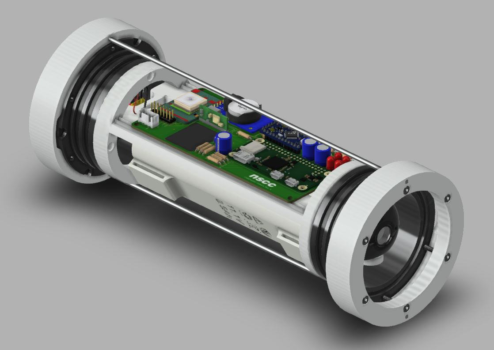

## Underwater Camera

### Overview
Underwater Camera Tag is designed for marine data collection. This device can be used as
a POV tag for aquatic turtles. The main interface for the system is a removable USB-flash drive. The on-board computer reads the drive during boot and stores all recorded data on it. During long deployments, more than one day, the Tag is designed to enter sleep mode to extend battery life.

### Operation
During deployment, the Tags computer records video and GPS location at daytime. The main computer shuts down for night-time operation to extend battery life. Recording cycles are handled by a separate microcontroller. Video files, GPS readings, and log file are stored on a removable USB flash drive.

### Main components
* Raspberry Pi + PiCamera 1080p30
* Arduino ProMini (Atmega328)
* Battery Bank + Charger/Boost
* Custom 3D printed parts
* Custom made PCB