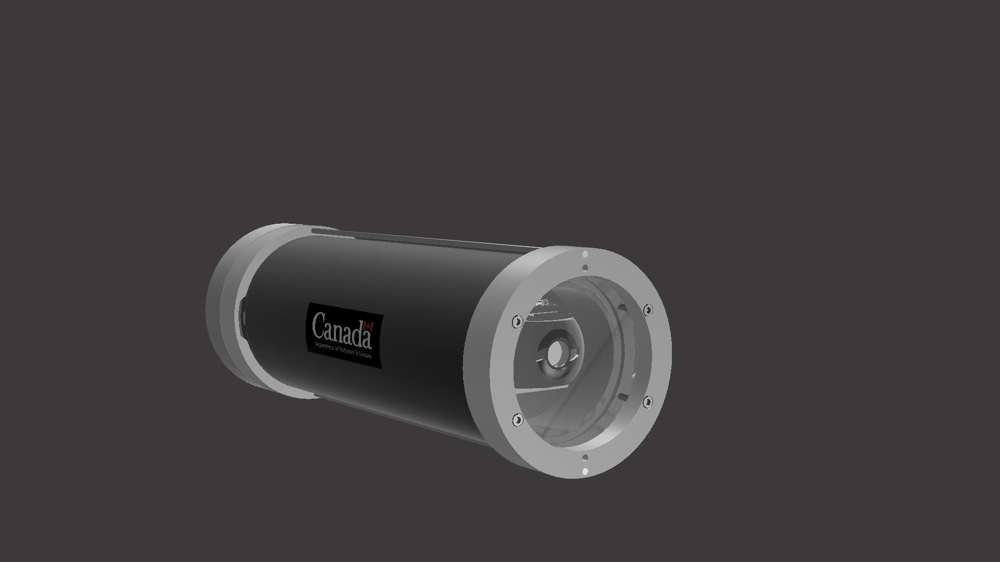
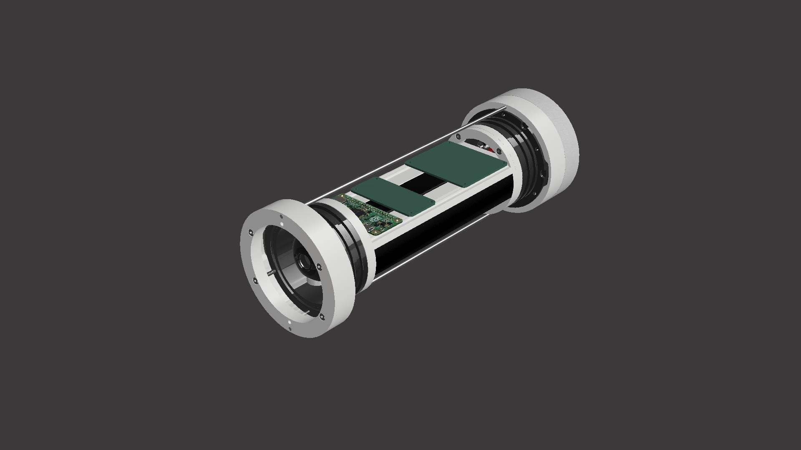

## Underwater POV Camera Tag V2.0

### Overview
The Underwater Camera unit is designed for marine data collection. The tag is geared for video recording and GPS data collection, as well as sensor data logging. This device can be used as a POV camera for aquatic turtles, or in stationary monitoring applications. The tags operating parameters are configured through a web user interface. 
### Operation
When deployed, the unit records video data during daytime and shuts down at night to extend battery life. A separate microcontroller handles recording cycles. Video files, GPS readings, and log file are stored on a removable USB flash drive.
### Main components
* Single Board Computer (Raspberry Pi Zero W) 
* Digital HD Camera 1080p30 (PiCamera v2.1)
* Microprocessor (ATMega328p)
* GPS module + Antenna
* Battery Bank (6/8 Lithium-ion cells)
* Custom 3D printed parts
* 3" Enclosure from BlueRobotics
* Custom made PCB